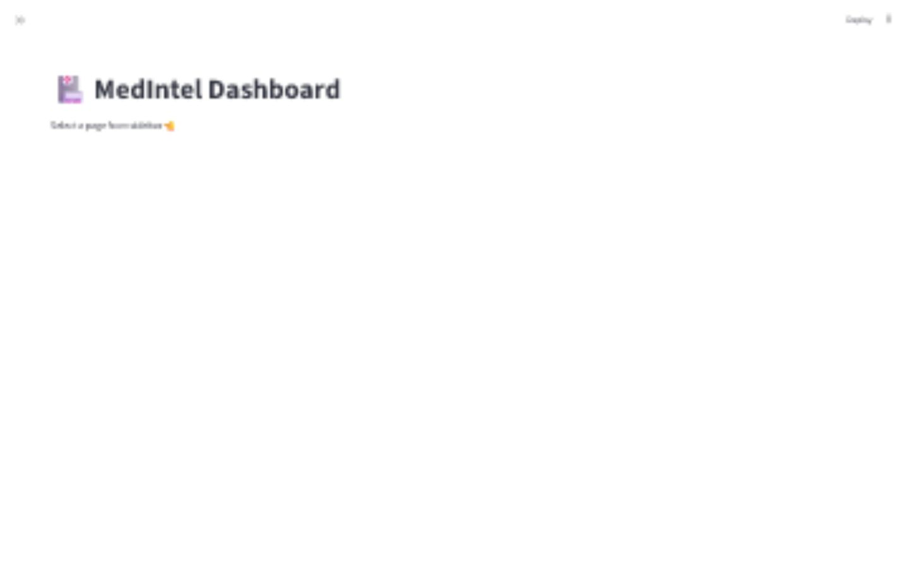
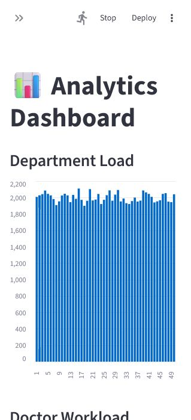
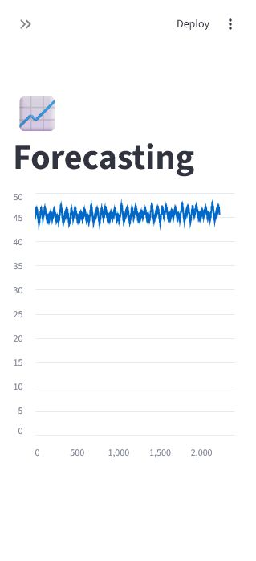
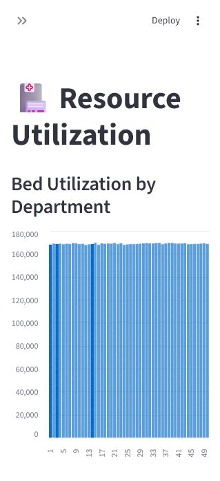
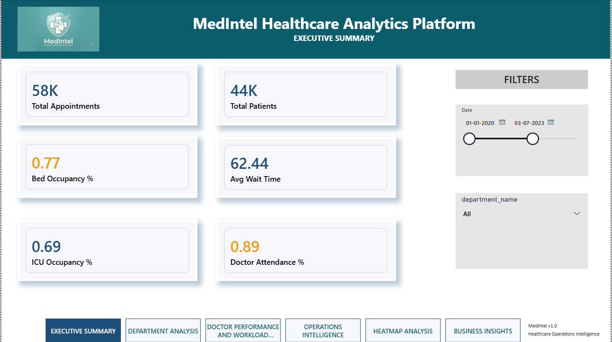
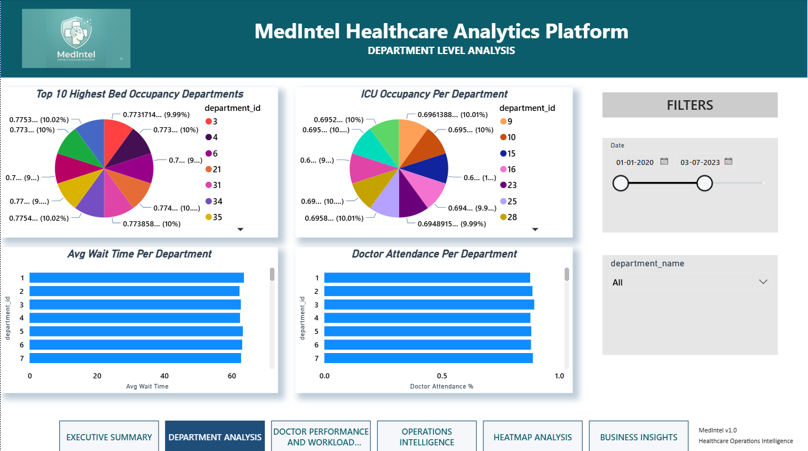
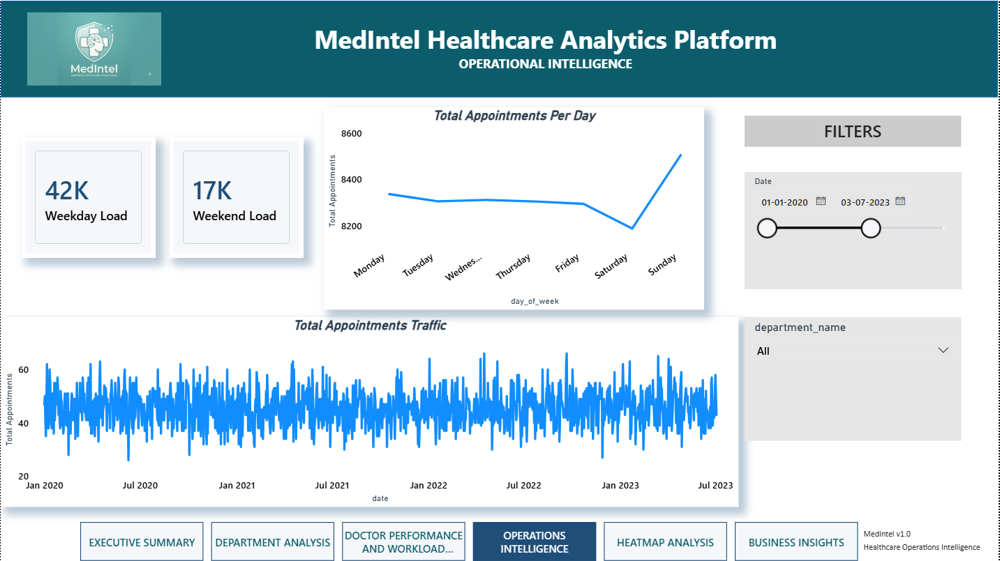
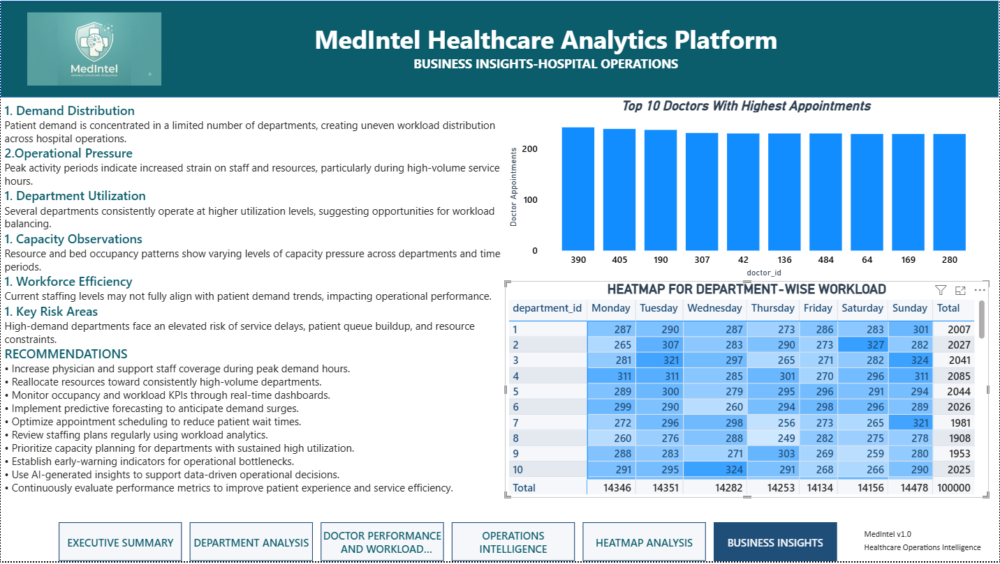
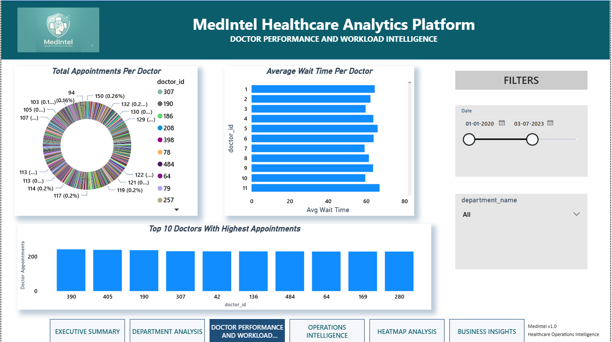
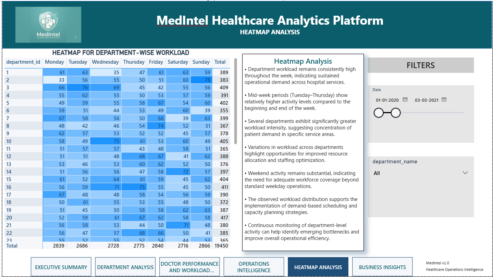

# MedIntel

Healthcare operations intelligence platform for hospital demand, wait-time, doctor workload, resource utilization, forecasting, and AI-assisted operational insights.


## Demo


## What This Project Shows

MedIntel is an end-to-end data project built around a simulated hospital operations environment. It demonstrates how raw operational data can move through a complete analytics system:

```text
Synthetic data -> ETL -> MySQL schema/views -> KPI outputs -> ML forecasting -> AI insights -> Streamlit dashboard
```

The repository includes two dashboard surfaces:

- **Streamlit dashboard**: the main interactive Python dashboard, run with `streamlit run dashboard/app.py`.
- **Netlify static preview**: a fast static landing/dashboard page for portfolio deployment, served from `index.html`.

Netlify does not run the Python Streamlit app directly. It hosts the static preview only. The full dashboard should be run locally or deployed to a Python-friendly host such as Streamlit Community Cloud, Render, Railway, or a VM.

## Product Screenshots

### Streamlit Dashboard

| Executive | Analytics | Forecasting |
| --- | --- | --- |
|  |  |  |

| Resources | AI Insights |
| --- | --- |
|  |  |

### Power BI Dashboard Screens

These screenshots are manually created Power BI dashboard views included as project documentation assets.

| Executive Summary | Department Analysis | Operational Intelligence |
| --- | --- | --- |
|  |  |  |

| Business Insights | Doctor Workload | Heatmap Analysis |
| --- | --- | --- |
|  |  |  |

## Core Features

- Synthetic hospital data generation for patients, doctors, departments, appointments, beds, staff, and equipment.
- Cleaning and feature engineering pipeline for analytics-ready CSV datasets.
- MySQL schema and analytical views for KPI reporting.
- Streamlit multipage dashboard for executive, analytics, forecasting, doctor, resource, and AI insight views.
- Forecasting workflow with baseline, Prophet, XGBoost, and evaluation scripts.
- AI insight layer that converts KPI metrics into natural language recommendations.
- Static Netlify preview for a fast public portfolio page.
- Power BI dashboard screenshots documenting executive BI outputs.

## Repository Map

```text
ai_insights/       KPI summarization and recommendation logic
analytics/         SQL KPI runner and exported CSV outputs
assets/            Logo and static site assets
dashboard/         Streamlit app and multipage dashboard
data/              Synthetic, clean, and feature-engineered CSV data
docs/              Architecture, database, deployment, BI images, demo assets
etl/               Data generation, cleaning, feature engineering, MySQL loading
ml_models/         Forecasting, anomaly detection, and evaluation scripts
sql/               MySQL schema, views, and analysis queries
index.html         Netlify/static preview entry point
netlify.toml       Netlify static hosting configuration
```

## Quickstart

### 1. Create a virtual environment

```bash
python -m venv .venv
```

Activate it:

```bash
# macOS/Linux
source .venv/bin/activate

# Windows PowerShell
.venv\Scripts\activate
```

### 2. Install dependencies

```bash
pip install -r requirements.txt
```

### 3. Generate local analytics data

```bash
python etl/run_pipeline.py
```

By default, this generates CSV data and skips MySQL loading. This makes the dashboard easy to run without a database.

### 4. Run the Streamlit dashboard

```bash
streamlit run dashboard/app.py
```

Open the local app at:

```text
http://localhost:8501
```

## MySQL Setup

The canonical schema is:

```text
sql/schema/create_tables.sql
```

This schema matches the ETL loader and analytics queries. It creates:

- `patients`
- `doctors`
- `departments`
- `appointments_features`
- `beds`
- `staff`
- `equipment`
- KPI views such as `vw_daily_operations`, `vw_department_summary`, and `vw_doctor_performance`

To load data into MySQL:

1. Run `sql/schema/create_tables.sql` in MySQL.
2. Copy `.env.example` to `.env` and set the database values.
3. Run the pipeline with MySQL loading enabled:

```bash
LOAD_MYSQL=true python etl/run_pipeline.py
```

On Windows PowerShell:

```powershell
$env:LOAD_MYSQL="true"
python etl/run_pipeline.py
```

Note: the schema file resets the `medintel` database, so only run it when a fresh rebuild is intended.

## Static Netlify Preview

The repo includes a lightweight static dashboard preview for Netlify:

- `index.html`
- `assets/site.css`
- `assets/site.js`
- `netlify.toml`

This preview reads CSV summaries from `analytics/output/` and displays a fast portfolio-friendly dashboard. It is not a replacement for the Streamlit app; it is a static public preview.

For Netlify:

- Build command: leave empty
- Publish directory: `.`

## Data and Analytics Outputs

Key generated and/or included outputs:

- `data/synthetic/`: generated raw hospital datasets
- `data/clean/`: cleaned operational datasets
- `data/features/appointments_features.csv`: main feature table
- `data/features/forecast_dataset.csv`: forecasting input
- `data/features/prophet_forecast.csv`: forecast output or local fallback
- `analytics/output/`: CSV KPI summaries used by static preview and BI storytelling

## Machine Learning Layer

The ML layer includes:

- `ml_models/data_prep.py`: builds forecasting dataset
- `ml_models/baseline_model.py`: naive and moving-average baselines
- `ml_models/prophet_model.py`: time-series forecasting
- `ml_models/xgboost_model.py`: feature-based demand modeling
- `ml_models/anamoly_detector.py`: anomaly detection workflow
- `ml_models/evaluation.py`: model quality metrics

## AI Insights Layer

The AI layer converts structured metrics into business-friendly recommendations:

- `ai_insights/analytics_engine.py`: KPI metric preparation
- `ai_insights/recommendation_engine.py`: rule-based recommendations
- `ai_insights/openai_insights.py`: insight formatting layer
- `dashboard/pages/6_AI.py`: Streamlit AI insights page

The default project flow works without an OpenAI key. Environment variables are documented in `.env.example`.

## Documentation

- [Architecture](docs/Architecture.md)
- [Database Design](docs/DatabaseDesign.md)
- [Deployment Guide](docs/Deployment.md)
- [Forecasting](docs/Forecasting.md)
- [KPI Framework](docs/KPIFramework.md)
- [SQL Analytics](docs/SQL_Analytics.md)
- [AI Insights](docs/AIInsights.md)
- [Case Study](docs/CaseStudy.md)
- [Business Requirements](docs/BRD.md)

## Business Value

MedIntel demonstrates how hospital operations teams can use data systems to:

- Identify wait-time bottlenecks.
- Monitor department demand.
- Balance doctor workload.
- Track resource and bed utilization.
- Forecast patient demand.
- Generate operational recommendations from KPI data.

## Status

This is a portfolio-ready analytics engineering project with a runnable Streamlit dashboard, MySQL schema, static Netlify preview, demo screenshots, Power BI dashboard images, and documented setup paths.
