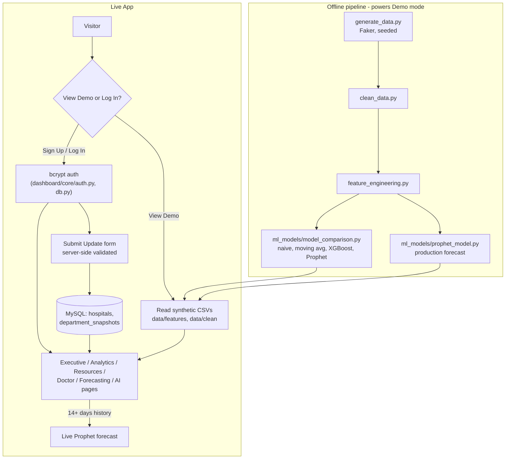

# MedIntel

MedIntel is a hospital operations dashboard: departments submit live bed, ICU, and staffing numbers, and the app turns that into an executive overview, resource utilization tracking, wait-time anomaly detection, demand forecasting, and an AI-generated plain-English recommendation — scoped privately to each hospital's own account.

**Live app: [medintel-izdnnaskn4d4jizmzf6pje.streamlit.app](https://medintel-izdnnaskn4d4jizmzf6pje.streamlit.app)** — click **View Demo** to explore immediately with no account, or **Sign Up** to create a real hospital account and submit your own data.


## Contents

- [Demo Video](#demo-video)
- [Screenshots](#screenshots)
- [Why This Exists](#why-this-exists)
- [Features](#features)
- [Tech Stack](#tech-stack)
- [Architecture](#architecture)
- [Project Structure](#project-structure)
- [Local Setup](#local-setup)
- [User Manual](#user-manual)
- [The Offline Data/ML Pipeline](#the-offline-dataml-pipeline)
- [Known Limitations](#known-limitations)
- [Resume Bullets](#resume-bullets)
- [Status](#status)

## Demo Video

*(to be added — a short screen recording walking through: View Demo → Sign Up → Log In → Submit Update → Executive/Resources/Forecasting/AI pages showing the just-submitted data)*

## Screenshots

*(to be added — see the checklist in the project notes for exactly which views to capture)*

## Why This Exists

Hospital departments track bed, ICU, and staffing numbers constantly, but that data is often stuck in spreadsheets or siloed systems with no shared, real-time view across departments. MedIntel gives a hospital one place to log current numbers and immediately see the operational picture: which departments are strained, whether wait times are drifting, and what the near-term bed-demand trend looks like — without needing a data team to build it.

## Features

- **Two ways to use it**: a **View Demo** mode (no account, explores six years of realistic simulated hospital data) and a real **Sign Up / Log In** flow for hospitals to track their own live data — both live on the same public app.
- **Real authentication** — bcrypt-hashed passwords, session-scoped access; each hospital only ever sees its own submitted data.
- **Live data entry** ("Submit Update" page) — per-department beds, ICU beds, staffing, and average wait time, with server-side validation (occupied can't exceed total, no negative values).
- **Executive Overview** — headline metrics at a glance: departments reporting, average wait time, average bed occupancy.
- **Analytics** — bed occupancy and wait time compared across departments, plus a wait-time trend over your submission history.
- **Resource Utilization** — bed/ICU occupancy by department, with a strain warning above 85%.
- **Wait-Time Anomaly Detection** — statistically flags submissions where wait time is unusually high relative to a hospital's own history (z-score based).
- **Forecasting** — projects your bed-occupancy trend forward using Prophet, once you have 14+ days of submission history (gated with a progress indicator until then, rather than showing a meaningless chart).
- **AI Insights** — a plain-English summary and a rule-based operational recommendation, generated live from the same metrics as the other pages.
- **Demo mode's dataset is a real, working ML showcase**: a synthetic 6-year hospital dataset (Faker-generated, reproducible via a fixed seed) flows through a full ETL pipeline into a genuine model comparison — naive baseline, 7-day moving average, XGBoost, and Prophet, each backtested on the same held-out window with real MAE/RMSE/MAPE (moving average currently wins — a real finding, not cherry-picked).

## Tech Stack

| Layer | Tech |
| --- | --- |
| App / UI | Streamlit |
| Auth | bcrypt password hashing, session-based access control |
| Live database | MySQL (TiDB Cloud Serverless), via SQLAlchemy + PyMySQL |
| Forecasting | Prophet (live, per-hospital) + Prophet/XGBoost/baselines (offline model comparison) |
| Data processing | Pandas, NumPy |
| Synthetic data | Faker |
| Deployment | Streamlit Community Cloud |
| Secrets | Streamlit Cloud Secrets (deployed) / `.env` via python-dotenv (local) |
| Offline BI | MySQL analytics schema + Power BI (separate from the live app's schema — see [Local Setup](#local-setup)) |

## Architecture


```mermaid
flowchart TD
    subgraph Live App
        A[Visitor] --> B{View Demo or Log In?}
        B -->|View Demo| C[Read synthetic CSVs<br/>data/features, data/clean]
        B -->|Sign Up / Log In| D["bcrypt auth<br/>(dashboard/core/auth.py, db.py)"]
        D --> E[Submit Update form<br/>server-side validated]
        E --> F[(MySQL: hospitals,<br/>department_snapshots)]
        D --> G[Executive / Analytics / Resources /<br/>Doctor / Forecasting / AI pages]
        F --> G
        C --> G
        G -->|14+ days history| H[Live Prophet forecast]
    end

    subgraph Offline pipeline - powers Demo mode
        I[generate_data.py<br/>Faker, seeded] --> J[clean_data.py]
        J --> K[feature_engineering.py]
        K --> L[ml_models/model_comparison.py<br/>naive, moving avg, XGBoost, Prophet]
        K --> M[ml_models/prophet_model.py<br/>production forecast]
        L --> C
        M --> C
    end
```

## Project Structure

```text
dashboard/
├── app.py                  # landing page: View Demo / Log In / Sign Up
├── core/
│   ├── db.py                # MySQL engine, schema bootstrap, auth, validated writes/reads
│   ├── auth.py               # session-state mode/access helpers
│   ├── theme.py               # centralized CSS injection, called on every page
│   └── data_loader.py          # demo-mode CSV loading
├── pages/
│   ├── 1_Submit_Update.py       # live data entry (logged-in only)
│   ├── 2_Executive.py            # dual-mode: demo CSV or live DB
│   ├── 3_Analytics.py
│   ├── 4_Forecasting.py           # live Prophet forecast, gated on history length
│   ├── 5_Doctor.py                 # per-doctor (demo) / per-department anomalies (live)
│   ├── 6_Resources.py
│   └── 7_AI.py
└── requirements.txt          # lean deployment deps (includes prophet - live forecasting needs it)

ai_insights/          # metrics -> plain-English summary + recommendation
ml_models/            # prophet_model.py, xgboost_model.py, model_comparison.py, anamoly_detector.py
etl/                  # generate_data.py, clean_data.py, feature_engineering.py, load_mysql.py, run_pipeline.py
data/                 # synthetic/, clean/, features/ - demo-mode CSVs (committed, no real PII, Faker-generated)
sql/                  # offline analytics schema/views (separate from the live app's schema)
schema.sql             # the LIVE app's schema (hospitals, department_snapshots) - reference only, app creates it automatically
docs/                 # architecture/design docs, demo assets, Power BI screenshots
index.html, netlify.toml   # separate static portfolio preview (not the live app)
```

## Local Setup

**To just run the dashboard against the live schema (no offline pipeline needed):**

```
pip install -r requirements.txt
```

Create a `.env` in the project root (never commit this):

```
DB_HOST=your-tidb-host
DB_PORT=4000
DB_USER=your-tidb-user
DB_PASSWORD=your-tidb-password
DB_NAME=medintel
```

Then:

```
streamlit run dashboard/app.py
```

The database and tables (`hospitals`, `department_snapshots`) are created automatically on first run — `schema.sql` is kept only as a readable reference, you don't need to run it by hand.

**To also regenerate the demo dataset / rerun the offline ML pipeline:**

```
python etl/run_pipeline.py
python -m ml_models.model_comparison
```

This regenerates `data/synthetic/`, `data/clean/`, `data/features/*.csv` (including `prophet_forecast.csv` and `model_comparison.csv`), which is what powers **View Demo** mode. This is unrelated to the live app's MySQL database — two entirely separate data paths.

## User Manual

**Demo mode:** click **View Demo** on the landing page — no account needed, browse all six pages immediately.

**Real hospital use:**
1. **Sign Up** with your hospital name, email, and a password (8+ characters).
2. **Log In**.
3. Go to **Submit Update** and enter your first department's numbers (beds, ICU, staffing, average wait time). Repeat this regularly (daily is enough) to build a real history.
4. Check **Executive**, **Analytics**, and **Resources** for your live numbers.
5. Once you have 14+ days of submissions, **Forecasting** unlocks a real bed-occupancy projection for your hospital specifically.
6. **AI Insights** gives a plain-English summary and recommendation, computed from your own latest data.

## The Offline Data/ML Pipeline

Separate from the live app, `etl/` + `ml_models/` produce the realistic 6-year synthetic dataset that powers **View Demo** mode, and demonstrate a genuine model-comparison workflow:

```text
generate_data.py (Faker, seeded) -> clean_data.py -> feature_engineering.py
    -> forecast_dataset.csv -> {prophet_model.py, xgboost_model.py, naive, moving avg}
    -> model_comparison.py backtests all four on the same held-out window -> model_comparison.csv
```

There's also a separate, optional MySQL **analytics** schema (`sql/schema/`) for Power BI reporting — set `LOAD_MYSQL=true` when running the pipeline to populate it. This is a different database/schema from the live app's `hospitals`/`department_snapshots` tables and serves a different purpose (BI export, not the live dashboard).

## Known Limitations

Being upfront about what "production" doesn't mean here:

- **No email verification** on signup — anyone can create an account with any email address.
- **No rate limiting or abuse protection** — not available on free-tier Streamlit Cloud infrastructure.
- **Not HIPAA-compliant, and never appropriate for real patient-identifiable data.** This tracks aggregate operational counts (bed/staff numbers), not patient records — real compliance would require a legal/audit process far beyond code.
- **Streamlit isn't architected for high-concurrency enterprise SaaS** the way a dedicated backend framework is — fine for a demo or a single hospital's internal use, not a claim of enterprise scale.

## Resume Bullets

```text
Built MedIntel, a live multi-tenant hospital operations dashboard (Streamlit, MySQL, bcrypt auth) where hospitals submit real-time bed/ICU/staffing data and receive an executive overview, resource utilization tracking, statistical wait-time anomaly detection, Prophet-based demand forecasting, and AI-generated recommendations, backed by a genuine offline model-comparison pipeline (naive, moving average, XGBoost, Prophet) benchmarked with real MAE/RMSE/MAPE.
```

## Status

Live and deployed. Core live-app features (auth, data entry, all 6 dashboard pages in both demo and live mode, forecasting, AI insights) are built and verified with Streamlit's headless `AppTest` framework across all page/mode combinations. Demo video and fresh screenshots are the remaining documentation items.
